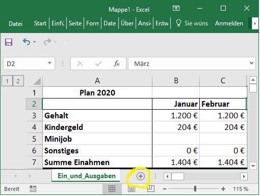
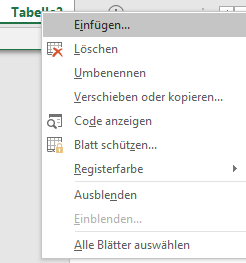
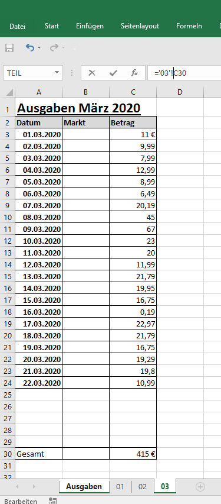
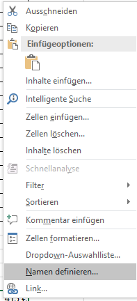
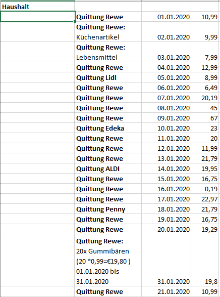

# haushaltsplan

## Einzeldetaillierungen

In vielen Fällen ist es ausreichend Belegbeträge für Ein- und Ausgaben dirket in einer Formalzusammen zufassen

Abbildung :Berechnung von monatlichen. Posten

Problematisch kann es aber sein, wenn hier sehr viele Belege aufsummiert werden müssen oder evtl. die Belegwerte noch nicht direkt verwendet werden können \(nicht ausgewiesener Preisnachlass, Anteilsberechnung, etc.\). Im Beispiel unten ist eine etwas aufwändigere Aufsummierung notwendig.

Abbildung : Aufsummierungen langer Posten

In einem solchen Fall ist die Nachvollziehbarkeit sehr schlecht. Bei korrektur einzelnen Werte oder Vertippen ist es sehr schwierig dieses einfach zu korrigieren und zu überprüfen, ebenso ist die Belegreihenfolge hier sehr wichtig, da die einzelposten nur Anhand der Reihenfolge identifiziert werden können.

## Verbesserungsmöglichkeiten

Einzelpositionen mit Datum und ggf. kurzer Info können auf verschiedene Arten hinzugefügt werden:

### Dokumentation der berechneten Summenposten

Dieses ist mittels Kommentar oder als Infos in anderen Zellen möglich, diese kann man ein und ausblenden, so dass der ausgedruckte Haushaltsplan aussieht als ob es diese Einzeldetaillierungen nicht gibt.

Das Problem, dass man hier einmal in der Berechnungsformel zum einen Werte aufsummiert und an anderer Stelle diese dokumentiert ist zum einen doppelt und löst in vielen nicht komplett das Problem der Nachvollziehbarkeit.

|  | Variante1: Beleginfos als Kommentar | Variante2: Beleginfos als ind anderen Zellen |
| :--- | :--- | :--- |

<table>
  <thead>
    <tr>
      <th style="text-align:left">
        
      </th>
      <th style="text-align:left">
        

          
        

        
Abbildung :Infos zu den Belegen als Kommentar

      </th>
      <th style="text-align:left">
        

          
        

        
Abbildung :Infos zu den Belegen in anderen Textzellen

      </th>
    </tr>
  </thead>
  <tbody></tbody>
</table>* Einzelpositionen in Nicht sichtbare Spalten, dieses Gruppieren zum Ausblenden
* Einzelpositionen in andere Tabellen eintragen und aufsummieren

Diese Tabellen können sich in im selben Tabellenblatt, einem anderen Tabellenblatt derselben Arbeitsmappe. Ebenso können diese Monatseinzelpositionen auf andere Dateien verteilt werden.

Der Einfachheit halber werden die Aufteilung auf unterschiedliche Dateien nicht erklärt, da es Probleme bei kopieren Speichern geben kann.

Man legt hierfür ein anderes Tabellenblatt an, dieses sollte sich in der gleichen Datei befinden. Das Auslagern in andere Dateien ist Gründen der Abhängigkeit und Aktualität von Daten nicht zu empfehlen.

Abbildung : Variante 1 - feste Referenzierung über Formel **Tabellenblatt!Zellbezug**

Abbildung : Variante 1 - feste Referenzieren über Formel **eindeutigen Namen einer Zelle**

### Gruppieren von Spalte- /Zeileninhalten

#### Gruppieren von Spalteninhalten

#### Gruppieren von Zeileninhalten

### Einzelposten in anderen Tabellensheets übertragen und die Ergebnisse übernehmen

Als Beispiel dient hier der März 2020. Hier wollen wird die Direkteingabe von € 400 oder Aufsummierung \(z.B. =50+50+50+50+50\) ersetzen durch eine detaillierte Teilauflistung.

Abbildung : März 2020

Die neue Tabellenblatt hat jetzt einen Namen wie Tabelle1.

Einen Rechtklick auf Tabelle 1 \(oder ähnlicher Tabellname\) ausführen.

Es erscheint folgendes Menü

Dort Umrennen auswählen und ein eindeutigen Namen Verwenden.

Da es hier um einen Haushaltsplan eines Jahrs geht, sind Bezeichnung Januar bis Dezember oder 01

bis 12 zu empfehlen.

Für März sind sind hier Tabelleninformationen einzutragen.

Wichtig ist die Spalte Datum und Betrag, Markt, Kaufort oder andere Kategorie sind individuell. Aber nach keder Spalte kann auch gefiltert werden , Daher macht zum Beispiel die die Eingabe von Kaufort /Markt sind wenn man ermitteln will wie viel man in einem Bestimmten Markt kauft.

Meistens lohnt sich die Mehrarbeit für solche Tabellen.

Später ist diesen nur mit viel Aufwand umzusetzen, daher empfiehlt es sich etwas mehr Zeit bei der Erstellung dieser Einzeltabellen zu investieren. Man kann auch wie im Beipiel erst mit reduzierten Daten Datum +Betrag anfangen und ggf. später Informationen nachtragen. Es sollte immer ein guter Kompromiss zwischen Detaillierrttheit und aufwand bestehen.

Am Ende ist eine Summenformel zu verwenden, welche die Summe eine Monatspostens repräsentiert.

Diese wird jetzt in der den Haushaltsplan übernommen

Der Wert aus der Tabelle 03 in der Zelle C30 ist über die Formel =‘Name des Tabellenblatts’!Zellbezug verfügbar.

Hier lautet die Formel wie folgt =‘03‘!C30 bzw. ‘März‘!C30.

Diese kann entweder direkt eingegben werden oder mit drurch Klickatktion mit der Maus erstellt werden.

Bei Direkteingabe die Formel wie oben dargstellt eingeben und am Ende die Enter-Taste drücken.

Soll dieser Wert durch Klicken mit der Maus übernommen werden.

Folgende Schritte:

1. Zeichen = mit der Tastatur ohne Enter eingeben.
2. Auf das Tabelleblatt 03 bzw. März klicken
3. Mit Taste Enter bestätigen

#### Nachteil des direkten Zellbezugs

Hierbei kann durch Verschiebungen, Kopieren , etc. es vorkommen, dass hier auf die falsche Zell zugegriffen wird. Ebenso kann man mit der Formel nicht viel anfangen, wenn man sich z.B. verklickt hat ist das nicht sofort ersichtlich.

Daher gibt es eine kleine Verbesserung um das sofort ersichtlich zu machen.

Bei Betätigen der rechten Maustaste

### Einzelposten in anderen Excel-dateien

### Ein- und Ausblenden von Spalten

### Ein- und Ausblenden von Spalten mittels Gruppierungsfunktion

### Auslagern von Einzeltabellen in andere Tabellenblätter

